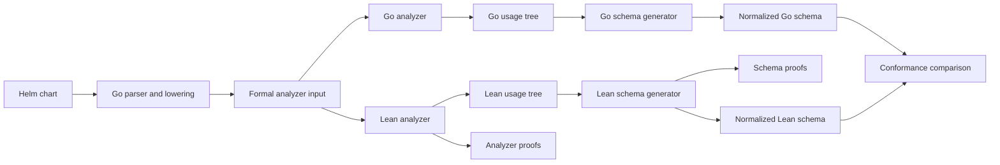

# Lean formal verification design

Status: Draft. This document defines a proposed design. It does not describe an implemented proof system.

## Reader guide

Lean is both a programming language and a theorem prover. A theorem prover checks a mathematical argument with strict machine-readable rules.

In this project, Lean will contain a small model of JSON values, usage evidence, and generated schemas. It will not read Helm charts directly.

A theorem is a statement about every input in that model. If its proof follows from the model definitions, Lean accepts the theorem.

For example, a unit test can reject one misspelled key named `paths`. A theorem can reject every unnamed key at the same closed boundary.

The Lean kernel is the small component that checks each proof. The project trusts this kernel instead of trusting a test result alone.

### Terms used in this document

| Term | Plain meaning |
|---|---|
| Model | A smaller mathematical description of the relevant program behavior. |
| Theorem | A statement that Lean proves for every input covered by the model. |
| Proof | A machine-checked argument for a theorem. |
| Proof boundary | The code and behavior that a theorem covers. |
| Trusted component | A component that the proof assumes works correctly. |
| Conformance test | A test that compares the Go result with the Lean result. |
| Semantic schema | The validation rules without descriptions, formatting, or key order. |
| Invariant | A property that remains true for all permitted operations. |
| Decidable | A property for which a terminating function can return true or false. |
| Algebra | A set of values and operations with proved laws. |

### Dynamic and open values

A dynamic property has a name that the template calculates. For example, a value can select a service name from another value.

The schema must permit new service names at that map boundary. It can still require known fields inside each service entry.

An open value is different. A template consumes the complete value, so every descendant can affect output or control flow.

For example, direct `toYaml` output makes its selected value open. A dynamic `index` operation makes only the selected map boundary dynamic.

Incorrect classification causes errors in both directions:

- A false open or dynamic result permits misspelled properties.
- A missed open or dynamic result rejects valid chart values.

Thus, proving only the schema builder is not sufficient. The formal plan must also prove how the analyzer classifies these operations.

## Decision summary

The first Lean project will formalize the schema policy, usage-tree algebra, and analyzer classification rules.

The Go command will remain the production implementation. A conformance program will compare the Go result with the Lean reference model.

Lean will not run during normal schema generation. The Helm plugin package will not contain Lean or require a Lean installation.

This design gives useful proofs without claiming that the complete Go command is verified.

## Purpose

The generated schema applies several rules that are easy to state incorrectly. These rules include closed objects, dynamic entries, null removal, and fixed defaults.

Unit tests cover selected inputs. Lean can prove policy properties for all inputs in the formal model.

Tests and proofs solve different problems:

| Method | What it establishes | Main limit |
|---|---|---|
| Unit test | One selected input gives the expected result. | It says nothing about untested inputs. |
| Lean proof | A property holds for every input in the formal model. | The model can differ from the Go code. |
| Conformance test | Go and Lean agree for selected real inputs. | It does not cover every possible Go input. |

The project needs all three methods. The proofs cover the model, and the conformance tests detect differences between the model and Go.

The formal work has these goals:

- Define the schema policy independently from the Go control flow.
- Prove the main safety and compatibility properties of that policy.
- Prove the analyzer rules that create open and dynamic usage evidence.
- Compare the Go implementation with an executable Lean reference model.
- Keep the production binary small and independent from the Lean toolchain.
- Prevent incomplete proofs from passing continuous integration.

## Worked example

The `flaresolverr` problem gives a small example of the intended result.

The template checks whether `readiness` is present. The same template reads known fields such as `enabled`, `type`, and `path`.

This usage defines a closed field contract. The schema must accept `path` and reject an unknown sibling such as `paths`.

The Go unit test covers the specific `paths` example. The proposed Lean theorem has a more general statement:

```text
For each property name k:
  if k is not a named readiness field,
  and readiness has no dynamic or open evidence,
  then the generated schema rejects a readiness object that contains k.
```

The theorem covers all property names and all defaults in its stated model. It does not depend on the `flaresolverr` chart name.

The conformance test then gives the same abstract input to Go and Lean. If their normalized schemas differ, the test fails.

This example shows four layers:

1. Analyzer rules classify the field use as structural, not open or dynamic.
2. The schema policy says that this known field contract stays closed.
3. Lean proves both classification and schema-policy results.
4. Conformance tests compare the production Go results with the Lean results.

## Meaning of verification

The project will make claims only about named theorems and their stated assumptions.

The first version will not call the complete Helm plugin formally verified. The proof boundary will not include these components:

- The Go parser that converts Helm syntax into the formal analyzer language.
- Template or Sprig behavior that the formal analyzer language does not represent.
- The Helm SDK and its value-coalescing implementation.
- The Go JSON encoder.
- The Helm JSON Schema validator.
- Kubernetes behavior.

The schema proofs will treat the analyzer result as an input. Separate analyzer proofs will start from a small formal template language.

Conformance tests give evidence that Go implements the Lean model. These tests do not turn the Go binary into proved code.

### Why the first boundary is narrow

The schema builder is a good first proof target because it is deterministic. Its output depends only on defaults, usage evidence, and null paths.

The builder also contains the policy decisions that caused the recent edge cases. These decisions include open objects, field contracts, and truth tests.

The template analyzer has a much larger behavior surface. It models Go templates, Helm scopes, Sprig functions, mutations, and recursive template calls.

A complete analyzer proof requires a formal template language and a formal evaluator. It also requires a connection between Helm syntax and that language.

Starting with the complete analyzer delays useful proofs. It also increases the chance of an inaccurate model.

The staged design first proves a small analyzer language. Later stages add more operations after the schema core stabilizes.

### What remains trusted

The schema proof assumes that Go supplies the correct defaults, usage tree, and null paths. A wrong analyzer result can still produce a wrong schema.

The analyzer proof reduces this assumption for operations in its formal language. Conformance tests compare Go analysis with Lean analysis for real template cases.

The Go parser remains trusted because it creates the formal analyzer input. Existing parser tests and real-chart tests continue to cover that translation.

The final schema also passes through Go JSON encoding and Helm validation. Existing integration tests continue to cover these components.

This separation keeps the formal claim honest. It also shows where later proof work adds value.

### How the parts connect



The proofs cover the Lean analyzer and schema generator. The conformance comparison connects selected Go results to those proved references.

The diagram has no proof arrow from Lean to Go. A test comparison is evidence, not a mathematical proof of the Go code.

The Go parser and lowering step remains trusted. It converts the full Helm language into the smaller formal analyzer input.

## Formal core

The Lean project will define five small models.

### JSON values

`JValue` will represent the JSON values that Helm schemas validate:

```lean
inductive JValue
  | null
  | bool (value : Bool)
  | number (value : JsonNumber)
  | string (value : String)
  | array (items : List JValue)
  | object (properties : CanonicalObject JValue)
```

`CanonicalObject` will provide unique keys and stable key order. This rule removes map-order differences from the proofs.

The number model must preserve the distinctions that affect the generated schema. It does not need floating-point arithmetic.

### Analyzer language

`TemplateIR` will represent the operations that create usage evidence. IR means intermediate representation, which is a smaller language for analysis.

The first version will include these operations:

- Fixed property selection.
- Dynamic property selection.
- Truth tests and comparisons.
- Collection iteration.
- Exact and complete consumers.
- Root and subtree template contexts.
- Object construction and selection.
- Branches, sequences, and template calls.

Later stages can add merge, mutation, dependency scopes, and more function classes.

The model will define how a `TemplateIR` program observes chart values. It will also define the usage tree that static analysis produces.

Two independent predicates will describe important classifications:

```lean
DynamicAt : TemplateIR → ValuePath → Prop
OpenAt : TemplateIR → ValuePath → Prop
```

`DynamicAt` means that a calculated property name can affect behavior at the path. `OpenAt` means that the complete selected value can affect behavior.

These predicates state semantic facts about the formal program. They do not inspect the output of the usage analyzer.

This independence prevents a circular proof. The analyzer must prove that its usage result agrees with these semantic predicates.

### Usage evidence

`Usage` will match the semantic fields in `internal/analyze.Usage`:

```lean
structure Usage where
  read : Bool
  exact : Bool
  allowUnknown : Bool
  open : Bool
  iterated : Bool
  properties : CanonicalObject Usage
  additional : Option Usage
  items : Option Usage
  elements : Option Usage
```

The model will define an evidence order. `u₁ ≤ u₂` means that `u₂` contains all evidence from `u₁`.

The `merge` function will compute the least upper bound in this order.

In plain terms, a merge keeps all facts from both inputs. It does not erase evidence that an earlier analysis found.

The algebra proofs prevent order-dependent analysis. Two template branches must produce the same merged usage in either processing order.

The formal model will distinguish these forms of non-static use:

| Usage field | Meaning |
|---|---|
| `open` | One operation consumes the complete selected value. |
| `additional` | A calculated map key selects entries that follow one child contract. |
| `allowUnknown` | Unknown direct properties can affect a template context. |
| `iterated` | Collection membership can affect control flow. |
| `elements` | Selected entries can come from either an object or an array. |

This distinction matters because each form opens a different boundary. A dynamic map entry must not make every descendant unrestricted.

### Schema language

`Schema` will represent only the Draft 7 subset that the Go generator emits:

- An unrestricted schema.
- A constant value.
- A scalar type.
- An object with named properties and an additional-property rule.
- An array with one item schema.
- A disjunction.
- A null alternative.

Descriptions and default annotations do not affect validation. The formal schema will keep them outside the semantic model.

The model will define both forms of validation:

```lean
Accepts : Schema → JValue → Prop
accepts : Schema → JValue → Bool
```

Lean will prove that the Boolean function decides the proposition.

This proof connects an executable function with a readable mathematical statement. It prevents the validator code and its stated meaning from disagreeing.

### Generation policy

The Lean `generate` function will consume this input:

```lean
structure CoreInput where
  defaults : CanonicalObject JValue
  usage : Usage
  explicitNullPaths : List JsonPointer
```

The result will contain a semantic `Schema` or a typed generation error.

The function will match the decisions in `internal/schema/schema.go`. It will not parse YAML, templates, or JSON text.

This pure input format is important. File parsing and serialization details do not belong in proofs about schema policy.

## Independent policy contract

The proofs need a contract that does not call `generate` internally.

`PermittedOverride defaults usage nullPaths candidate` will define the intended policy directly. It will use recursive rules for each value boundary.

The contract will define these cases:

- An unused present default keeps its original value.
- An unknown property fails at a closed object.
- An unknown property follows the entry contract at a dynamic map.
- A complete use permits descendant names and values that match the selected shape rules.
- A structural field contract permits only its named fields.
- A pure truth test can depend on membership in an empty object.
- An explicit null override can remove the selected map property.
- A replacement list follows its inferred item contract.

This contract gives the generator theorem an independent statement. A restatement of the generator algorithm does not provide a useful proof.

Without this separation, the project can define “correct” as “whatever `generate` returns.” A proof of that definition gives no protection against policy mistakes.

The independent contract states the intended behavior first. The generator proof must then connect the implementation to that separate behavior.

## Theorems

The first proof set will contain these theorem groups.

| Group | Required result |
|---|---|
| Validator | `accepts s v = true ↔ Accepts s v`. |
| Usage merge | Merge is associative, commutative, and idempotent. |
| Usage merge | Empty usage is the identity value. |
| Usage merge | Each input is less than or equal to its merged result. |
| Analyzer classification | Every semantic open use produces `open` evidence at the same path. |
| Analyzer classification | Every semantic dynamic selection produces dynamic evidence at the same path. |
| Analyzer classification | Each `open` or dynamic result has a semantic derivation. |
| Analyzer classification | A static property selection does not create dynamic or open evidence. |
| Analyzer independence | An unrecorded property cannot affect a modeled program result. |
| Fixed defaults | An unchanged unused default is accepted. |
| Fixed defaults | A changed present unused default is rejected. |
| Default compatibility | Successful generation accepts the effective default tree. |
| Closed objects | An unnamed property is rejected without open or dynamic evidence. |
| Dynamic maps | Every unnamed entry follows the inferred entry schema. |
| Truth tests | A known field contract keeps a truth-tested object closed. |
| Truth tests | A pure truth test opens only an effectively empty object. |
| Root object | The root rejects unrelated properties without open or dynamic evidence. |
| Null removal | An explicit null path accepts the raw removal form. |
| Generator contract | Generated validation is equivalent to `PermittedOverride`. |

The generator-contract theorem is the final theorem for the formal core. Earlier changes can merge after their smaller theorem groups are complete.

The project will not assert that more usage evidence always permits more values. Structural evidence can make an earlier open approximation more precise.

### Both classification directions

The analyzer proofs must cover both classification directions.

The first direction prevents missed evidence. If an operation can observe a dynamic key or complete value, the usage tree must record that fact.

This direction prevents false rejections. The schema builder receives enough evidence to permit valid dynamic or open values.

The second direction prevents unjustified evidence. Each dynamic or open usage result must have a derivation from modeled template behavior.

This direction protects typo detection. An analyzer bug cannot silently open a boundary without a matching semantic rule.

For deliberately conservative operations, the derivation will identify the conservative rule. The result will not appear as an exact classification.

This provenance makes precision loss visible. It also permits later proofs and tests to target each conservative rule.

### Why these theorems matter

The validator theorem establishes that the executable Lean validator has the stated meaning.

The merge theorems establish that analysis order cannot remove usage evidence. They also establish that duplicate evidence does not change the result.

The analyzer theorems establish that open and dynamic states match the modeled template behavior. These theorems protect validation in both directions.

The default theorems protect compatibility with an unchanged chart. Helm must accept the chart defaults after schema generation.

The object theorems protect typo detection. They define the cases that reject or permit new property names.

The truth-test theorems cover the distinction that fixed the `paths` problem. A truth check alone differs from a known child-field contract.

The null theorem covers Helm map removal. A null map value can remove a default before Helm validates the effective values.

The final theorem joins these local results. It establishes that generation and the independent policy contract accept the same values.

## Go and Lean boundary

The Go and Lean implementations will exchange two kinds of versioned JSON documents.

An analysis document will compare usage classification:

```json
{
  "version": 1,
  "kind": "analysis",
  "program": {},
  "goUsage": {}
}
```

A schema document will compare schema generation:

```json
{
  "version": 1,
  "kind": "schema",
  "defaults": {},
  "usage": {},
  "explicitNullPaths": [],
  "goSchema": {}
}
```

The protocol will represent semantic usage and schema data. It will omit descriptions and other non-validation annotations.

This omission prevents irrelevant differences from failing conformance. Description text and JSON key order do not change whether Helm accepts a value.

For an analysis document, the conformance executable will complete these operations:

1. Decode the formal analyzer program and the Go usage tree.
2. Analyze the program with Lean.
3. Compare both normalized usage trees.
4. Report the first different path and evidence field.

For a schema document, the executable will complete these operations:

1. Decode one `CoreInput` and one Go schema.
2. Generate the Lean reference schema.
3. Normalize the Go schema into the Lean schema language.
4. Compare both semantic schemas.
5. Report the first different JSON pointer and rule.

The comparison will use exact normalized structure. Bounded value enumeration can add diagnostics, but it will not replace structural comparison.

Structural comparison is stronger than comparing a small value sample. Two different schemas can agree on sampled values and differ on another value.

Go tests will create protocol documents from existing fixtures. The fixtures will include each high-risk analyzer and generator branch.

The conformance suite will also use generated small trees. These trees will use bounded depth, property count, and list length.

### Why the project keeps two implementations

The Go implementation already integrates with Helm and produces one native plugin binary. An immediate replacement adds packaging and runtime work.

The Lean reference implementation makes the policy executable and provable. The conformance gate detects differences while the Go implementation remains in production.

This design is a compromise. It gives formal policy proofs, but the Go connection still depends on tests.

The stronger future design removes this compromise. In that design, production schema generation calls the proved Lean implementation.

## Repository layout

The Lean project will stay below `formal`:

```text
formal/
  lean-toolchain
  lakefile.toml
  HelmSchema/
    Json.lean
    TemplateIR.lean
    Analyze.lean
    Usage.lean
    Schema.lean
    Policy.lean
    Generate.lean
    Protocol.lean
    Proofs/
      Analyzer.lean
      Validator.lean
      Usage.lean
      Defaults.lean
      Objects.lean
      Nulls.lean
      Generator.lean
  Verify/
    Main.lean
  Tests/
    Main.lean
```

The first version will use Lean core libraries and `Std`. It will not add Mathlib unless a proof needs a specific maintained result.

The `lean-toolchain` file will pin one exact stable Lean release. Lean does not guarantee source compatibility across all monthly releases.

An exact pin makes local and continuous-integration proof results reproducible. A toolchain update becomes a reviewed project change.

## Build and continuous integration

The Makefile will provide these commands:

```text
make test       # Run Go tests.
make verify     # Build the Lean proofs and run conformance tests.
make test-all   # Run both suites.
```

Continuous integration will run `make test-all`. Release builds will run the same command before packaging.

The normal `make build` command will not require Lean. Plugin installation from source will continue to require only Go and Helm.

This separation keeps the current installation experience. Contributors need Lean only for changes to the formal suite or local formal tests.

Lean compilation will treat warnings as errors. Source files will set `autoImplicit` to false.

The proof tree must not contain `sorry`, `admit`, or project axioms. Continuous integration will reject these declarations.

Lean accepts `sorry` as a temporary placeholder during development. The repository must reject it because a placeholder is not a completed proof.

### Expected contributor workflow

A normal Go-only change continues to use `make test`. Continuous integration also runs the existing formal suite against that Go change.

A schema-policy change updates the Go implementation, the Lean model, its proofs, and the conformance cases in one pull request.

A theorem-only change runs `make verify`. It does not rebuild or package the Helm plugin.

## Implementation stages

The stages keep each review small. Each completed stage gives useful results without depending on unfinished later stages.

### Stage 1: Usage algebra

This stage adds the Lean project, `JValue`, `Usage`, the evidence order, and merge proofs.

Go fixtures will compare `Usage.Merge` with Lean `merge`.

This stage starts with the smallest stable data type. Its laws are independent from JSON Schema details.

### Stage 2: Analyzer classification core

This stage adds `TemplateIR` with fixed selection, dynamic selection, complete use, truth tests, iteration, branches, and template contexts.

It proves that dynamic and open evidence agrees with the independent `DynamicAt` and `OpenAt` predicates.

This stage directly protects the decision that controls whether an object boundary accepts unknown properties.

### Stage 3: Schema semantics

This stage adds the schema language, the Boolean validator, and the validator proof.

It also adds normalization for the generated Draft 7 subset.

This stage establishes the meaning of schema validation before it proves schema generation.

### Stage 4: Core generator

This stage adds the independent policy contract and the Lean reference generator.

Each generator branch will have a local theorem before the final contract theorem.

Local theorems make proof errors easier to diagnose. They also connect each policy branch to one reviewable statement.

### Stage 5: Conformance gate

This stage adds the versioned protocol, the Lean executable, and generated Go cases.

Continuous integration will run conformance tests for every change to the Go or Lean core.

This stage compares both analyzer usage and generated schemas. It connects proved Lean behavior to production Go behavior through repeatable tests.

### Stage 6: Value flows

This stage can formalize dependency value-flow remapping after the schema core is stable.

The first flow theorems will cover prefix mapping, composition, termination, and evidence preservation.

Value-flow proofs come later because they belong to analysis, not schema construction.

### Stage 7: Analyzer coverage

This stage adds every production operation class that can create open or dynamic evidence.

The operation classes include merge, mutation, dependency scopes, unknown-function fallbacks, and recursive template-call limits.

The formal model does not require one rule for every Sprig function. Go functions map to proved semantic classes.

The Go function-to-class mapping remains trusted. Conformance fixtures must cover every production mapping that creates open or dynamic evidence.

## Alternatives considered

### Prove the complete Helm command first

This option gives the strongest final claim. It also requires formal models for Helm loading, templates, Sprig, YAML, and dependency behavior.

The required model is large and difficult to compare with Helm releases. This option does not give an early, reviewable proof result.

### Put Lean in the production path immediately

This option gives a stronger connection between proofs and runtime behavior. It removes the duplicate schema generator after the Go adapter creates `CoreInput`.

It also changes plugin packaging, installation, cross-platform builds, and error handling. The project will evaluate this option after the reference model stabilizes.

### Prove only helper functions

Small helper proofs are easy to complete. They do not establish the important policy properties across a complete generated schema.

The proposed design includes local helper theorems, but the generator-contract theorem remains the final target.

### Use only property-based tests

Generated tests can cover many more cases than handwritten unit tests. They still inspect a finite input set.

The project will use generated cases for conformance diagnostics. They supplement the proofs and do not replace them.

## What a failure means

A Lean proof error means that a theorem no longer follows from the formal definitions. The policy, implementation, or proof requires correction.

A conformance error means that Go and Lean produced different semantic schemas for one input. It does not identify which implementation is correct.

A Go integration error means that the surrounding Helm behavior changed or broke. The formal core can still be internally correct in this case.

These error classes need different investigation. Continuous integration must report them as separate jobs.

## Review rules

Each formal change must include these items:

- A plain-English statement of each new theorem.
- The assumptions for each theorem.
- A Go regression case for a theorem that describes production behavior.
- A conformance case for each new protocol shape.
- No theorem whose contract calls the function that it claims to specify.

Proof size is not a quality measure. Definitions and theorem statements must remain small enough for manual review.

## Risks

The largest risk is model drift. The conformance gate reduces this risk, but it does not prove the Go implementation.

The second risk is a circular policy contract. Separate recursive definitions and review rules reduce this risk.

The third risk is an unstable proof toolchain. An exact `lean-toolchain` pin and small dependency set reduce this risk.

The fourth risk is excessive scope. The first version does not formalize raw Helm syntax, the full Sprig library, Helm internals, or Kubernetes.

## Stronger future boundary

A later version can make the Lean generator the production implementation. Go can call a compiled Lean library or executable.

That design removes the duplicated generator from the trusted application path. It also adds runtime, packaging, and cross-platform costs.

This stronger boundary requires a separate decision. It is not part of the first implementation.

## Acceptance criteria

The first formal-verification version requires all these results:

- Lean proves every theorem group in this document.
- Lean proves both directions for dynamic and open classification in `TemplateIR`.
- The formal analyzer covers every production operation class that can create dynamic or open evidence.
- Conformance fixtures cover every Go mapping to those operation classes.
- The Lean source contains no incomplete proof or project axiom.
- Go and Lean produce equal normalized usage trees and schemas for all conformance cases.
- The conformance cases cover every schema-generator decision branch.
- Existing Go, Helm lint, plugin, and real-chart tests still pass.
- `make build` and plugin installation do not require Lean.
- Continuous integration runs the formal suite before release packaging.
