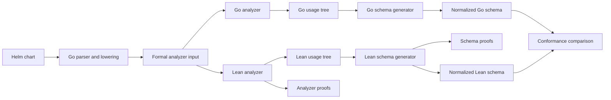

# Lean formal verification

Status: Implemented for the compiled recursive schema core and dependency value flows. The complete Helm plugin is not formally verified.

## Implementation status

The repository contains a Lean 4.33.1 project in `formal`.

The current implementation includes these results:

- Usage merge is associative. It is also commutative and idempotent by fact membership.
- Raw usage normalization preserves present empty nodes.
- The analyzer covers fixed, finite, dynamic, open, exact, iterative, and conservative operations.
- Analyzer theorems prove exact observation, node, key, open, dynamic, and fallback results in both directions.
- The Boolean schema validator is equivalent to the declarative `Accepts` relation.
- Exact JSON numbers follow Helm's mathematical equality and integer rules.
- Canonical JSON values have reflexive semantic equality. Canonical objects have unique names at every depth.
- The policy-to-schema compiler is equivalent to the declarative `Permitted` relation.
- `core_contract_correct` connects generated validation to `CoreInputPermitted`. The contract does not call the policy compiler or schema generator.
- Direct contracts cover used arrays, shape alternatives, conjunctions, and structured dynamic entries.
- Dependency flow proofs cover suffix retention, both directions, transitive paths, exact search results, and output provenance.
- A complete registry maps all 238 pinned Helm, Sprig, and Go template functions to formal operation classes.
- `allowsUnnamed_iff_relevant` connects the executable boundary decision to independent raw relevance reasons.
- A strict audit checks every declaration in the formal library. It permits only Lean's `propext` and `Quot.sound` axioms.
- Eleven concrete templates compare production usage with the Lean analyzer.
- The boundary suite checks 1,547 combinations of defaults and usage flags.
- Six value-flow cases compare production propagation with Lean.
- All 238 function rows compare production classes with Lean lowerings.
- The schema suite compares 260 generated Go and Lean schemas.
- Forty-three cases compare the Lean validator directly with Helm 4.

The current proof boundary has these limits:

- `CoreInput` is a formal adapter input. Go still classifies raw defaults as fixed values, leaves, or recursive objects before Lean receives them.
- The three advanced shape cases start from a compiled `CoreInput`. Lean does not yet derive these inputs from raw defaults and usage.
- The conformance protocol cannot compare internal Go evidence reasons because the production analyzer exports only its usage tree.
- The function registry assignment remains trusted. The proof covers class lowering, not the behavior of each external function implementation.
- The Go template parser, lowering rules, Helm SDK, and Go implementation remain trusted.

[Stage 6](#stage-6-raw-input-compiler) defines the next proof boundary. It starts from source-aware defaults, raw usage, and explicit-null paths.

The sections below distinguish implemented work from future work. A statement that uses “will” describes future work.

## Reader guide

Lean is both a programming language and a theorem prover. A theorem prover checks a mathematical argument with strict machine-readable rules.

In this project, Lean contains a small model of JSON values, usage evidence, and generated schemas. It does not read Helm charts directly.

A theorem is a statement about every input in that model. If its proof follows from the model definitions, Lean accepts the theorem.

For example, a unit test can reject one misspelled key named `paths`. A theorem can reject every unnamed key at the same closed boundary.

The Lean kernel is the small component that checks each proof. The project trusts this kernel instead of trusting a test result alone.

### Terms used in this document

| Term | Plain meaning |
|---|---|
| Model | A smaller mathematical description of the relevant program behavior. |
| Theorem | A statement that Lean proves for every input covered by the model. |
| Proof | A machine-checked argument for a theorem. |
| Proof boundary | The code and behavior that a theorem covers. |
| Trusted component | A component that the proof assumes works correctly. |
| Conformance test | A test that compares the Go result with the Lean result. |
| Semantic schema | The validation rules without descriptions, formatting, or key order. |
| Invariant | A property that remains true for all permitted operations. |
| Decidable | A property for which a terminating function can return true or false. |
| Algebra | A set of values and operations with proved laws. |
| Exact classification | A result derived from modeled template behavior. |
| Conservative result | A safe result used when the analyzer cannot make an exact classification. |
| Model provenance | The source version and rule that support one part of the formal model. |

### Dynamic, open, and conservative results

A calculated property name is not automatically dynamic. The analyzer can keep fixed properties when it proves a finite set of possible names.

A schema-dynamic property has no finite fixed-name bound in the formal model. For example, an overridable value can select an arbitrary service name.

The schema must permit new service names at that map boundary. It can still require known fields inside each service entry.

A semantically open value is different. A template consumes the complete value, so every descendant can affect output or control flow.

For example, direct `toYaml` output makes its selected value open. An unbounded `index` operation makes only the selected map boundary dynamic.

A conservative result is not a semantic fact about the chart. The analyzer uses it when an operation prevents an exact classification.

The schema stays open at that boundary because a closed schema can reject valid values. The result must record the operation that caused this loss of precision.

Incorrect classification causes errors in both directions:

- A false exact open or dynamic result permits misspelled properties.
- A missed open or dynamic result rejects valid chart values.
- An unnecessarily broad conservative result also permits misspelled properties.

Thus, proving only the schema builder is not sufficient. The formal model must prove classification and record each conservative decision.

The proof claim has three levels:

| Level | Claim |
|---|---|
| Formal analyzer | Lean proves exact classification and justified fallback for every `TemplateIR` program. |
| Go analyzer | Conformance tests compare Go and Lean classification for exported analyzer programs. |
| Raw Helm template | Parser and lowering tests provide evidence, but not a formal proof. |

A proof about raw Helm source requires a verified parser and lowering step. That larger task remains outside the first version.

## Prior work and model sources

The initial review did not find a theorem-prover model for Helm templates or Go `text/template`. This result does not prove that none exists.

Existing projects still provide useful specifications, implementation details, and test cases:

| Source | Use in this project | Limit |
|---|---|---|
| [Go `text/template` documentation](https://pkg.go.dev/text/template) | Defines actions, pipelines, variables, `dot`, branches, iteration, and template calls. | The documentation is not a machine-checked semantics. |
| [Go 1.26 template implementation](https://github.com/golang/go/tree/go1.26.0/src/text/template) | Resolves behavior that the documentation does not fully specify. | A later release toolchain can change this behavior. |
| [Helm 4 template guide](https://docs.helm.sh/docs/chart_template_guide/) | Defines the public Helm template language and its built-in objects. | The guide does not define every function in formal terms. |
| [Helm 4.2.4 engine function map](https://github.com/helm/helm/blob/v4.2.4/pkg/engine/funcs.go) | Defines Helm additions, removed Sprig functions, and late-bound functions such as `include` and `tpl`. | Some functions receive their behavior later in the rendering engine. |
| [Sprig 3.3.0](https://github.com/Masterminds/sprig/tree/v3.3.0) | Defines the functions that Helm adds to Go templates. | The formal model groups functions by behavior instead of proving each implementation. |
| [gopls template support](https://go.dev/gopls/features/templates) | Provides parser cases and examples of known static-analysis limits. | It does not provide complete scoping or Helm function semantics. |
| [tmpl analyzer](https://pkg.go.dev/github.com/tylermmorton/tmpl) | Provides examples of Go template traversal and static analysis. | It targets typed Go template data, not Helm value-schema inference. |
| [Goose](https://github.com/goose-lang/goose) | Shows how another project states a trusted translation boundary for a Go subset. | It uses Rocq and does not model Go templates. |
| [Red Hat chart verifier](https://github.com/redhat-certification/chart-verifier) | Provides real chart checks and integration-test categories. | It runs concrete Helm operations and does not prove template-analysis rules. |

The formal model uses versioned source code as its final behavior reference. Documentation and other analyzers provide explanations and test cases.

The initial source baseline follows the current Go module:

| Component | Initial version | Source of the version |
|---|---|---|
| Helm SDK | `v4.2.4` | `go.mod` |
| Go language and standard library | `go1.26.0` | The `go` directive and release toolchain |
| Sprig | `v3.3.0` | The resolved Go module graph |

The `go 1.26.0` directive records the standard-library baseline. Release builds must use that toolchain when they claim conformance with its behavior.

The current cases are in [`formal/FEATURE_MATRIX.md`](formal/FEATURE_MATRIX.md).

The executable production function matrix contains these fields:

- The function name.
- The production analyzer class.
- The corresponding formal lowering.

The source baseline pins the Helm, Sprig, and Go versions. The registry does not store a source location for each function.

Lean proves each class lowering. Focused Go analyzer tests cover operations that need argument-sensitive behavior.

The pinned source list is separate from the registry. Tests reject a missing name, an extra name, or more than one class for a name.

This matrix prevents an unreviewed function from silently using a formal class. The class assignment itself remains a trusted modeling decision.

The initial review gives these analyzer classes:

| Operation class | Examples | Formal treatment |
|---|---|---|
| Fixed selection | `.Values.image.tag`, `index` with a fixed key | Exact structural selection. |
| Finite calculated selection | A folded expression with fixed alternatives | Record each selected key and prove that the finite set covers all executions. |
| Unbounded calculated selection | `get` or `index` with an arbitrary input key | Exact `DynamicAt` evidence at the selected collection boundary. |
| Scalar read | Comparisons, arithmetic, and truth tests | Exact read evidence without descendant access. |
| Complete consumer | Direct output of an object or list | Exact `OpenAt` evidence. |
| Key consumer | `keys`, membership, and collection length | Exact direct-key evidence without descendant access. |
| Origin-preserving transform | Serialization, quoting, and indentation | Preserve origins until a later operation consumes the result. |
| Fixed template call | `template`, `include`, or fixed `tpl` text | Analyze the called template with its supplied context. |
| Dynamic template call | A calculated template name or user-supplied `tpl` text | Use a path-specific conservative result. |
| Object construction or mutation | `dict`, `set`, `unset`, `omit`, and merge functions | Use exact fixed-key rules or dynamic-key evidence. |
| Unknown function or command | An unclassified function with value origins | Use a conservative result for only the affected arguments. |
| External behavior | `lookup` and other environment-dependent operations | Use an explicit unsupported rule. |
| Analysis limit | A recursive call or alternative limit | Use an explicit fallback reason at the affected context. |

The complete 238-name list is in `internal/analyze/function_contracts_test.go`. The production classes are in `internal/analyze/function_contracts.go` and `internal/analyze/functions.go`.

A class alone is not proof that each external function implementation has that behavior. It is a reviewed production assumption.

## Decision summary

The Lean project formalizes the schema policy, usage-tree algebra, and analyzer classification rules.

The Go command remains the production implementation. A conformance program compares the Go result with the Lean reference model.

Lean does not run during normal schema generation. The Helm plugin package does not contain Lean or require a Lean installation.

This design gives useful proofs without claiming that the complete Go command is verified.

## Purpose

The generated schema applies several rules that are easy to state incorrectly. These rules include closed objects, dynamic entries, null removal, and fixed defaults.

Unit tests cover selected inputs. Lean can prove policy properties for all inputs in the formal model.

Tests and proofs solve different problems:

| Method | What it establishes | Main limit |
|---|---|---|
| Unit test | One selected input gives the expected result. | It says nothing about untested inputs. |
| Lean proof | A property holds for every input in the formal model. | The model can differ from the Go code. |
| Conformance test | Go and Lean agree for selected real inputs. | It does not cover every possible Go input. |

The project needs all three methods. The proofs cover the model, and the conformance tests detect differences between the model and Go.

The formal work has these goals:

- Define the schema policy independently from the Go control flow.
- Prove the main safety and compatibility properties of that policy.
- Prove the analyzer rules that create finite, dynamic, open, and conservative evidence.
- Compare the Go implementation with an executable Lean reference model.
- Keep the production binary small and independent from the Lean toolchain.
- Prevent incomplete proofs from passing continuous integration.

## Worked example

The `flaresolverr` problem gives a small example of the intended result.

The template checks whether `readiness` is present. The same template reads known fields such as `enabled`, `type`, and `path`.

This usage defines a closed field contract. The schema must accept `path` and reject an unknown sibling such as `paths`.

The Go unit test covers the specific `paths` example. The implemented boundary and core theorems have a more general statement:

```text
For each property name k:
  if k is not a named readiness field,
  and readiness has no dynamic or open evidence,
  then the generated schema rejects a readiness object that contains k.
```

The theorem covers all property names and all defaults in its stated model. It does not depend on the `flaresolverr` chart name.

The conformance test then gives the same abstract input to Go and Lean. If their normalized schemas differ, the test fails.

This example shows four layers:

1. Analyzer rules classify the field use as structural, not open or dynamic.
2. The schema policy says that this known field contract stays closed.
3. Lean proves both classification and schema-policy results.
4. Conformance tests compare the production Go results with the Lean results.

## Meaning of verification

The project makes claims only about named theorems and their stated assumptions.

The first version does not call the complete Helm plugin formally verified. The proof boundary does not include these components:

- The Go parser that converts Helm syntax into the formal analyzer language.
- Template or Sprig behavior that the formal analyzer language does not represent.
- The Helm SDK and its value-coalescing implementation.
- The Go JSON encoder.
- The Helm JSON Schema validator.
- Kubernetes behavior.

The schema proofs treat the analyzer result as an input. Separate analyzer proofs start from a small formal template language.

Conformance tests give evidence that Go implements the Lean model. These tests do not turn the Go binary into proved code.

### Why the first boundary is narrow

The schema builder is a good first proof target because it is deterministic. Its output depends only on defaults, usage evidence, and null paths.

The builder also contains the policy decisions that caused the recent edge cases. These decisions include open objects, field contracts, and truth tests.

The template analyzer has a much larger behavior surface. It models Go templates, Helm scopes, Sprig functions, mutations, and recursive template calls.

A complete analyzer proof requires a formal template language and a formal evaluator. It also requires a connection between Helm syntax and that language.

Starting with the complete analyzer delays useful proofs. It also increases the chance of an inaccurate model.

The staged design first proves a small analyzer language. Later stages add more operations after the schema core stabilizes.

### What remains trusted

The schema proof assumes that Go supplies the correct defaults, usage tree, and null paths. A wrong analyzer result can still produce a wrong schema.

The analyzer proof reduces this assumption for operations in its formal language. Conformance tests compare Go analysis with Lean analysis for real template cases.

The Go parser remains trusted because it creates the formal analyzer input. Existing parser tests and real-chart tests continue to cover that translation.

The final schema also passes through Go JSON encoding and Helm validation. Existing integration tests continue to cover these components.

This separation keeps the formal claim honest. It also shows where later proof work adds value.

### How the parts connect



The proofs cover the Lean analyzer and schema generator. The conformance comparison connects selected Go results to those proved references.

The diagram has no proof arrow from Lean to Go. A test comparison is evidence, not a mathematical proof of the Go code.

The Go parser and lowering step remains trusted. It converts the full Helm language into the smaller formal analyzer input.

## Formal core

The Lean project defines small models for JSON, usage, template behavior, schemas, policies, and adapter contracts.

### JSON values

`JValue` represents the JSON values that Helm schemas validate:

```lean
inductive JValue
  | null
  | bool (value : Bool)
  | number (value : JsonNumber)
  | string (value : String)
  | array (items : List JValue)
  | object (properties : JObject JValue)
```

The current `JObject` type is a list of key-value pairs. The protocol must sort keys and remove duplicate keys before conversion.

The proofs use lookup behavior. They do not depend on object order.

The exact decimal number model preserves mathematical equality without floating-point arithmetic. Default type inference keeps separate source evidence for `integer` and `number`.

### Analyzer language

`TemplateIR` represents the operations that create usage evidence. IR means intermediate representation, which is a smaller language for analysis.

The current language includes these operations:

- Fixed property selection.
- Calculated property selection with finite or unbounded results.
- Truth tests and comparisons.
- Collection iteration.
- Exact and complete consumers.
- Root and subtree template contexts.
- Object construction and selection.
- Branches, sequences, and template calls.
- An explicit unsupported operation with a fallback reason and affected path.

Later stages can add merge, mutation, dependency scopes, and more function classes.

The model defines exact behavior for supported operations. An unsupported operation has no exact behavior rule.

The model also defines the usage facts that static analysis produces. The unsupported operation creates conservative evidence at its affected path.

Four independent predicates describe important analyzer decisions:

```lean
SelectsKey : TemplateIR → UsagePath → String → Prop
DynamicAt : TemplateIR → UsagePath → Prop
OpenAt : TemplateIR → UsagePath → Prop
UnsupportedAt : TemplateIR → UsagePath → UsageMode → FallbackReason → Prop
```

`SelectsKey` means that one execution can select the named property. `OpenAt` means that the complete selected value can affect behavior.

`DynamicAt` is an independent derivation for an unbounded selector in `TemplateIR`.

Lean proves that a dynamic selector can select every string. A finite selector can select only a name in its supplied list.

Thus, a calculated key with three known alternatives is not dynamic. The analyzer records those three fixed selections.

`SelectsKey`, `DynamicAt`, and `OpenAt` state semantic facts. `UnsupportedAt` identifies an operation that the exact model does not cover.

`UnsupportedAt` does not state that the chart is semantically open. It states why the analyzer cannot safely close the selected boundary.

`SelectsKey`, `DynamicAt`, and `OpenAt` apply to supported evaluation rules. `UnsupportedAt` applies to the explicit unsupported operation.

This independence prevents a circular proof. The analyzer must prove that its usage result agrees with these semantic predicates.

The Lean analyzer produces an evidence reason for each non-static result:

```lean
inductive EvidenceKind
  | dynamicSelection
  | completeConsumption
  | conservativeFallback (reason : FallbackReason) (mode : UsageMode)

structure EvidenceReason where
  path : List UsageSegment
  kind : EvidenceKind
```

These reasons make each open boundary reviewable. They also distinguish exact classification from deliberate loss of precision.

The usage tree remains the schema-generator input. The analyzer result contains both the usage tree and its evidence reasons.

### Usage evidence

The formal boundary keeps the recursive Go usage tree in `RawUsage`. Lean then normalizes it into node and observation facts:

```lean
structure Usage where
  nodes : List UsagePath
  observations : List Observation

structure Observation where
  path : List UsageSegment
  mode : UsageMode
```

The path segments represent fixed properties, additional properties, list items, and shape-independent elements.

`nodes` preserves present empty children. This distinction matters because an empty `additional`, `items`, or `elements` node is structural evidence even when it has no observation flag.

Duplicate facts and list order have no semantic effect. The protocol sends the recursive tree instead of a flattened observation list. Lean performs the normalization.

The model defines equivalence by node and observation membership. One usage value contains another when it contains all the same facts.

The `merge` function appends both observation lists.

In plain terms, a merge keeps all facts from both inputs. It does not erase evidence that an earlier analysis found.

The algebra proofs prevent order-dependent analysis. Two template branches must produce the same merged usage in either processing order.

The formal model distinguishes these forms of non-static use:

| Usage field | Meaning |
|---|---|
| `open` | Descendants are permitted because of complete consumption or a named fallback. |
| `additional` | A calculated map key selects entries that follow one child contract. |
| `allowUnknown` | Unknown direct properties can affect a template context. |
| `iterated` | Collection membership can affect control flow. |
| `elements` | Selected entries can come from either an object or an array. |

This distinction matters because each form opens a different boundary. A dynamic map entry must not make every descendant unrestricted.

### Schema language

`Schema` represents the Draft 7 subset needed by generation and Helm validation:

- An unrestricted schema.
- A constant value.
- A scalar type.
- An object with named properties and an additional-property rule.
- An array with one item schema.
- A disjunction.
- A conjunction for sibling JSON Schema constraints.

Descriptions and default annotations do not affect validation. The formal schema keeps them outside the semantic model.

The model defines both forms of validation:

```lean
Accepts : Schema → JValue → Prop
accepts : Schema → JValue → Bool
```

Lean proves that the Boolean function decides the proposition.

This proof connects an executable function with a readable mathematical statement. It prevents the validator code and its stated meaning from disagreeing.

### Generation policy

The Lean generator consumes an intermediate recursive `Policy`:

```lean
inductive Policy
  | unrestricted
  | constant (value : JValue)
  | typed (kind : JsonType)
  | object (properties : List (String × Policy)) (additional : Option Policy)
  | array (items : Policy)
  | anyOf (alternatives : List Policy)
  | allOf (constraints : List Policy)
```

The `Permitted` relation defines the meaning of this policy without a call to `generate`.

Lean proves `Accepts (generate policy) value ↔ Permitted policy value`.

This theorem covers the semantic schema construction. It does not prove that Go creates the correct `Policy` from defaults and usage.

The current `CoreInput` adapter contains a recursive `ValueInput` tree.

A `ValueInput` can be unrestricted, typed, a scalar leaf, a fixed value, an object, an array, a disjunction, or a conjunction.

An object contains named properties and an optional structured dynamic-entry contract. It also contains the boundary input for unstructured unknown properties.

The adapter preserves the source type distinction between an integer default and a number default. For example, Go infers `2` as `integer`, but it infers `2.0`, `2e0`, and `float64(2)` as `number`. JSON Schema can still accept these values as mathematical integers when a schema explicitly requires `integer`.

The structural comparison includes used arrays, shape alternatives, and structured dynamic-entry contracts. These cases enter Lean after Go classifies the compiled shape.

## Independent policy contract

The proofs have two contract levels:

- `Permitted policy candidate` defines the meaning of the intermediate policy language.
- `CoreInputPermitted input candidate` defines candidate acceptance directly on the formal adapter input. It does not call `Permitted`, `corePolicy`, or `generate`.

`core_contract_correct` proves that generated validation is equivalent to `CoreInputPermitted` for every compiled `CoreInput`.

The direct contract defines these cases:

- An unused present default keeps its original value.
- An unknown property fails at a closed object.
- A complete use permits descendant names and values that match the selected shape rules.
- A structural field contract permits only its named fields.
- A pure truth test can depend on membership in an empty object.
- An explicit null override can remove the selected map property.
- A canonical unused fixed value is accepted unchanged.
- An array accepts only arrays whose members satisfy the item contract.
- A shape alternative accepts only a candidate accepted by one alternative.
- A conjunction requires every constraint to accept the candidate.
- A structured unknown property must satisfy its dynamic-entry contract.

A future raw contract will start before Go classifies `ValueInput`. Stage 6 defines this contract and its source-aware default format.

The compiled contracts for used arrays and structured dynamic entries are complete. The future raw compiler must derive these contracts without an unrestricted fallback.

This contract gives the generator theorem an independent statement. A restatement of the generator algorithm does not provide a useful proof.

Without this separation, the project can define “correct” as “whatever `generate` returns.” A proof of that definition gives no protection against policy mistakes.

The independent contract states the intended behavior first. The generator proof must then connect the implementation to that separate behavior.

## Theorems

The larger proof target contains these theorem groups. The implementation-status section identifies the current subset.

| Group | Required result |
|---|---|
| Validator | `accepts s v = true ↔ Accepts s v`. |
| Usage merge | Merge is associative, commutative, and idempotent. |
| Usage merge | Empty usage is the identity value. |
| Usage merge | Each input is less than or equal to its merged result. |
| Analyzer classification | Every semantic key selection appears in its finite summary or at a dynamic boundary. |
| Analyzer classification | Every exact finite summary contains all semantically selected keys. |
| Analyzer classification | Each key in an exact finite summary has a semantic derivation. |
| Analyzer classification | Every semantic open use produces an exact open reason at the same path. |
| Analyzer classification | Every semantic dynamic selection produces an exact dynamic reason at the same path. |
| Analyzer classification | Each exact open or dynamic reason has a semantic derivation. |
| Analyzer classification | Each conservative reason has an `UnsupportedAt` derivation. |
| Analyzer classification | Each schema-opening usage flag has an exact or conservative reason. |
| Analyzer classification | A supported static property selection creates no non-static reason. |
| Analyzer independence | For a supported program, an unrecorded property cannot affect its modeled result. |
| Fixed defaults | An unchanged unused default is accepted. |
| Fixed defaults | A changed present unused default is rejected. |
| Default compatibility | Successful generation accepts the effective default tree. |
| Closed objects | An unnamed property is rejected without open or dynamic evidence. |
| Dynamic maps | Every unnamed entry follows the inferred entry schema. |
| Truth tests | A known field contract keeps a truth-tested object closed. |
| Truth tests | A pure truth test opens only an effectively empty object. |
| Root object | The root rejects unrelated properties without open or dynamic evidence. |
| Null removal | An explicit null path accepts the raw removal form. |
| Used arrays | Generated arrays apply the direct item contract to every replacement item. |
| Shape alternatives | Generated disjunctions accept exactly the direct alternatives. |
| Structured entries | An unknown name cannot bypass the structured dynamic-entry contract. |
| Value flows | Prefix remapping retains the complete suffix in both directions. |
| Value flows | The executable pass records every path returned by its bounded search. |
| Value flows | Propagation retains the observation mode and all original observations. |
| Function registry | Every pinned function has exactly one reviewed class and one formal lowering. |
| Generator contract | Current: generated validation is equivalent to `CoreInputPermitted`. Future: prove the same result from raw defaults, usage, and null paths. |

`core_contract_correct` is the main theorem for the current formal adapter boundary. A later raw-input theorem will replace it as the main generator theorem.

The project does not assert that more usage evidence always permits more values. Structural evidence can make an earlier open approximation more precise.

### Both classification directions

The analyzer proofs must cover both exact-classification directions.

The first direction prevents missed evidence. The analysis must cover each selected key and each complete-value use.

A finite key summary must contain every selected key. An unbounded selection must create dynamic evidence.

This direction prevents false rejections. The schema builder receives enough evidence to permit valid dynamic or open values.

The second direction prevents unjustified exact evidence. Each exact result and each reported fixed key must have a semantic derivation.

This direction protects typo detection. An analyzer bug cannot silently open a boundary without a matching semantic rule.

For conservative operations, a separate derivation identifies the unsupported operation and fallback rule. It does not claim semantic openness.

This provenance makes precision loss visible. It also permits later proofs and tests to target each conservative rule.

### Why these theorems matter

The validator theorem establishes that the executable Lean validator has the stated meaning.

The merge theorems establish that analysis order cannot remove usage evidence. They also establish that duplicate evidence does not change the result.

The analyzer theorems establish that exact open and dynamic states match the modeled behavior. They also make conservative decisions explicit.

The default theorems protect compatibility with an unchanged chart. Helm must accept the chart defaults after schema generation.

The object theorems protect typo detection. They define the cases that reject or permit new property names.

The truth-test theorems cover the distinction that fixed the `paths` problem. A truth check alone differs from a known child-field contract.

The null theorem covers Helm map removal. A null map value can remove a default before Helm validates the effective values.

The final theorem joins these local results. It establishes that generation and the direct adapter contract accept the same values.

## Go and Lean boundary

The current conformance program reads one versioned JSON document from standard input:

```json
{
  "version": 3,
  "cases": [
    {
      "name": "empty template",
      "operations": [],
      "usage": {
        "read": false,
        "exact": false,
        "allowUnknown": false,
        "open": false,
        "iterated": false,
        "properties": [],
        "additional": null,
        "items": null,
        "elements": null
      }
    }
  ],
  "flows": [],
  "functions": [],
  "boundaries": [],
  "schemas": [],
  "validations": []
}
```

Each Go case analyzes a concrete template. The case also supplies the expected normalized `TemplateOperation` values.

Lean analyzes these operations. Then Lean compares its normalized node and observation facts with the recursive Go usage tree.

The function section contains all 238 production matrix rows. Lean lowers each class and compares the resulting operation name.

The flow section contains usage before propagation, copy edges, and production usage after propagation. Lean applies the same edges to the initial usage.

The current cases cover these behaviors:

- A scalar truth test.
- Complete root serialization.
- A fixed literal index.
- Direct key inspection.
- Finite and unbounded calculated map keys.
- Exact checksum input.
- Collection iteration and element access.
- An unknown function with a named conservative reason.

The boundary cases compare `AllowsUnknownRootProperties` with the Lean `allowsUnnamed` decision. The protocol sends actual canonical default values. Lean derives whether Helm removes every direct null member.

The schema cases compare the compiled recursive `CoreInput` fragment.

The cases include nested typo rejection, nested null paths, nullable objects, used arrays, shape alternatives, and structured dynamic entries.

Go removes annotations before the semantic comparison.

The protocol omits descriptions and non-validation annotations.

Evidence reasons exist for proofs, conformance, and diagnostics. The normal command does not print them as warnings.

This omission prevents irrelevant differences from failing conformance. Description text and JSON key order do not change whether Helm accepts a value.

For a current analysis document, the conformance executable completes these operations:

1. Decode the formal analyzer program and the Go analyzer result.
2. Analyze the program with Lean.
3. Compare both normalized node and observation sets.
4. Report both normalized usage values when they differ.

For a current schema case, the executable completes these operations:

1. Decode one recursive `CoreInput` and one normalized Go schema.
2. Generate the Lean reference schema.
3. Compare both semantic schemas.
4. Report both schemas when they differ.

The comparison uses exact normalized structure. Bounded value enumeration can add diagnostics, but it does not replace structural comparison.

Structural comparison is stronger than comparing a small value sample. Two different schemas can agree on sampled values and differ on another value.

Go tests create protocol documents from concrete templates, an exhaustive boundary bit matrix, a bounded scalar matrix, recursive object fixtures, and generated high-risk schemas.

The validation section sends semantic schemas and candidate values directly to Helm 4. Lean must return the same acceptance result. This check is independent from the policy-to-schema proof.

### Why the project keeps two implementations

The Go implementation already integrates with Helm and produces one native plugin binary. An immediate replacement adds packaging and runtime work.

The Lean reference implementation makes the policy executable and provable. The conformance gate detects differences while the Go implementation remains in production.

This design is a compromise. It gives formal policy proofs, but the Go connection still depends on tests.

The stronger future design removes this compromise. In that design, production schema generation calls the proved Lean implementation.

## Repository layout

The Lean project stays below `formal`:

```text
formal/
  lean-toolchain
  lakefile.toml
  HelmSchema.lean
  HelmSchema/
    Analyze.lean
    Boundary.lean
    Contract.lean
    Core.lean
    Flow.lean
    Generate.lean
    Json.lean
    Policy.lean
    Schema.lean
    TemplateIR.lean
    Usage.lean
    Proofs/
      Analyzer.lean
      Boundary.lean
      Core.lean
      Flow.lean
      Generator.lean
      Usage.lean
      Validator.lean
  Audit/
    Main.lean
  Verify/
    Main.lean
  Tests/
    Main.lean
```

The formal project uses Lean core libraries and `Std`. It does not use Mathlib.

The `lean-toolchain` file pins one exact stable Lean release. Lean does not guarantee source compatibility across all monthly releases.

An exact pin makes local and continuous-integration proof results reproducible. A toolchain update becomes a reviewed project change.

## Build and continuous integration

The Makefile provides these commands:

```text
make test       # Run Go tests.
make verify     # Build the Lean proofs and run conformance tests.
make test-all   # Run both suites.
```

The repository exposes `make test-all` as its complete verification command. Continuous-integration and release workflows must run it before packaging.

The normal `make build` command does not require Lean. Plugin installation from source requires only Go and Helm.

This separation keeps the current installation experience. Contributors need Lean only for changes to the formal suite or local formal tests.

Lean compilation treats warnings as errors. Source files set `autoImplicit` to false.

The proof tree must not contain `sorry`, `admit`, or project axioms. `make verify` rejects these declarations and runs a kernel axiom audit with `--trust=0`.

Lean accepts `sorry` as a temporary placeholder during development. The repository must reject it because a placeholder is not a completed proof.

### Expected contributor workflow

A normal Go-only change continues to use `make test`. Continuous integration must also run the formal suite against that Go change.

A schema-policy change updates the Go implementation, the Lean model, its proofs, and the conformance cases in one pull request.

A theorem-only change runs `make verify`. It does not rebuild or package the Helm plugin.

## Implementation stages

The stages keep each review small. Each completed stage gives useful results without depending on unfinished later stages.

| Stage | Current status |
|---|---|
| 0. Prior work and provenance | Implemented for the pinned source baseline and 238-function registry. |
| 1. Usage algebra | Implemented. |
| 2. Analyzer classification core | Implemented for the current `TemplateIR`. |
| 3. Schema semantics | Implemented. |
| 4. Core generator | Implemented for compiled `CoreInput`, including arrays, alternatives, conjunctions, and structured entries. |
| 5. Conformance gate | Implemented. It checks 11 analyzer, 6 flow, 238 function, 1,547 boundary, 260 schema, and 43 validator cases. |
| 6. Raw-input compiler | Next. Go still creates `CoreInput`. |
| 7. Full value shapes | Implemented at the compiled `CoreInput` boundary. Raw derivation waits for Stage 6. |
| 8. Value flows | Implemented for bidirectional dependency and global-value prefix copies. |
| 9. Analyzer coverage | The 238-function matrix is implemented. Raw parser lowering remains trusted. |

### Stage 0: Prior work and model provenance

This stage pins the Helm 4, Go, Sprig, and Lean source versions.

Each supported production operation must map to one exact `TemplateIR` rule or one named fallback rule.

The separate source list and production registry contain all 238 pinned functions. Tests reject missing, extra, and duplicate registry entries.

Protocol version 3 sends each registry row to Lean. Lean compares the production class lowering with the formal class lowering.

A later source-version update must update the pinned list, affected production classes, and focused fixtures.

### Stage 1: Usage algebra

This stage added the Lean project, `JValue`, `Usage`, and merge proofs.

The Go-to-Lean fixtures compare merged usage facts through analyzer cases.

This stage starts with the smallest stable data type. Its laws are independent from JSON Schema details.

### Stage 2: Analyzer classification core

This stage added `TemplateIR` with fixed selection, calculated selection, complete use, truth tests, iteration, branches, and template contexts.

It proves finite-key coverage and agreement with `DynamicAt` and `OpenAt`. It also proves that each fallback agrees with `UnsupportedAt`.

This stage directly protects the decision that controls whether an object boundary accepts unknown properties.

### Stage 3: Schema semantics

This stage added the schema language, the Boolean validator, and the validator proof.

It also added normalization for the generated Draft 7 subset.

This stage establishes the meaning of schema validation before it proves schema generation.

### Stage 4: Core generator

This stage added the intermediate policy contract, the direct `CoreInput` contract, and the Lean reference generator.

The implemented branches have local theorems and the final `core_contract_correct` theorem.

Local theorems make proof errors easier to diagnose. They also connect each policy branch to one reviewable statement.

### Stage 5: Conformance gate

This stage added the versioned protocol, the Lean executable, and generated Go cases.

`make verify` runs conformance tests for changes to the Go or Lean core.

This stage compares analyzer usage, dependency flows, function rows, and generated schemas. It also compares the Lean validator with Helm 4.

### Stage 6: Raw-input compiler

Stage 6 moves the proof boundary before the current `CoreInput` classification. This stage is the next implementation task.

The current theorem starts after Go makes these decisions:

- A value is fixed, a scalar leaf, or an object.
- A scalar default gives an `integer`, `number`, `boolean`, or `string` rule.
- A missing or null value gives a nullable object rule.
- A nested value receives inherited-used and inherited-open state.

The current theorem proves the result after these decisions. It does not prove that the decisions follow from defaults and usage.

Lean already derives open object boundaries from raw usage and direct defaults. Stage 6 keeps that boundary theorem and removes the remaining adapter decisions.

Stage 6 adds a Lean compiler for these decisions. Go still loads Helm values and converts them into a small source-aware input.

This Go conversion preserves representation facts. It does not decide whether a value is fixed, configurable, open, or closed.

The stage does not add a YAML parser to Lean. The Helm loader and the Go-to-Lean conversion remain trusted.

#### Source-aware defaults

In this design, a raw default is a coalesced effective value from Helm. It is not raw YAML text.

The loader restores an absent explicit-null member as `RawValue.null`. This restoration keeps the member available for schema construction.

An explicit-null path remains separate from the restored default. The path can also accompany a non-null coalesced dependency default.

A plain `JValue` does not contain enough type evidence for schema inference. JSON has one numeric value type.

Go and YAML keep an important source distinction. The default `2` gives an `integer` schema. The defaults `2.0` and `2e0` give a `number` schema.

These three values are mathematically equal. Thus, mathematical JSON equality cannot recover the source type.

The raw compiler will use this source-aware value type:

```lean
inductive RawValue where
  | null
  | boolean (value : Bool)
  | integer (value : Int)
  | number (value : JsonNumber)
  | string (value : String)
  | array (items : List RawValue)
  | object (properties : JObject RawValue)
```

`RawValue.integer` and `RawValue.number` preserve schema type evidence. A conversion to `JValue` removes only this source distinction.

Constants still use mathematical JSON equality after this conversion. As a result, Helm can treat equivalent numeric spellings as equal.

The protocol must preserve numeric tags at every depth. It must not preserve them only for top-level scalar leaves.

The string form stays unchanged. Thus, Lean can identify the exact `{{` substring without a classification result from Go.

An independent `ScalarTypeEvidence` relation will state the permitted scalar type for each raw value.

The executable inference function must agree with this relation:

```lean
inferScalarType_correct :
  inferScalarType value = some kind ↔
    ScalarTypeEvidence value kind
```

The string evidence constructor requires that the string does not contain `{{`. The integer and number constructors use the source-aware variants directly.

The Go adapter also converts aliases and pointers into this raw format. A typed nil pointer, map, or slice becomes `RawValue.null`.

The formal model will define canonical raw values. Canonical objects have unique property names at every depth.

The protocol parser must reject duplicate names. The main compiler theorem must include the canonical-input requirement.

`RawValueInput.Valid` and `RawCoreInput.Valid` will collect input invariants. These invariants cover canonical defaults, unique usage names, and valid null paths.

#### Missing values and usage-node presence

The compiler must preserve two pairs of different states:

- `none` for a default means that the property is missing.
- `some RawValue.null` means that the property has a null default.
- `none` for usage means that no usage node exists.
- `some {}` means that a present usage node has no observation flag.

These states produce different schemas. A missing usage node can keep a present default fixed with `const`.

A present empty usage node records direct usage at its property. The property entry is structural evidence at its parent boundary.

Only the root input crosses the Go-to-Lean boundary:

```lean
structure RawCoreInput where
  defaults : JObject RawValue
  usage : RawUsage
  explicitNullPaths : List ValuePath
```

Go normalizes absent root usage to an empty `RawUsage`. Child lookups use `Option RawUsage` because child-node presence changes the schema.

The compiler creates an internal cursor during recursion:

```lean
structure RawValueInput where
  defaultValue : Option RawValue
  usage : Option RawUsage
  explicitNullPaths : List ValuePath
  inheritedUsed : Bool := false
  inheritedOpen : Bool := false
```

Go must not supply `inheritedUsed` or `inheritedOpen`. The compiler derives both fields from ancestor evidence.

The recursive propagation equations are:

```lean
direct := usage.isSome
usageNode := usage.getD {}
open := inheritedOpen || usageNode.isOpen
used := inheritedUsed || open
```

A direct read does not set `used` for descendants. Only the rules in these equations propagate the two inherited states.

At the root, `open := usage.isOpen` and `used := open`. The root compiler passes these values to its property cursors.

Each child cursor receives paths relative to that child. The child operation removes one matching property segment from each path.

An empty path means that the current property accepts an explicit null removal. A nonempty path applies to a descendant.

A root input cannot contain an empty null path. Each root path must name at least one property.

`inheritedUsed` and `inheritedOpen` remain separate because they control different schema rules. The compiler must prove each propagation rule.

#### Independent override contract

Stage 6 will add `RawCorePermitted`. This public relation states candidate acceptance directly on `RawCoreInput`.

A recursive `OverridePermitted` helper will use internal cursors. Public cursor theorems must require `ReachableCursor root cursor`.

This requirement prevents a caller from inventing inherited state that no root input can produce.

The direct raw contract must not call these definitions:

- `compileValue`.
- `compileCore`.
- `valuePolicy`.
- `corePolicy`.
- `generate`.
- `Permitted`.
- `CoreInputPermitted`.
- `ValueInputPermitted`.
- `allowsUnnamed`.
- Policy-construction helpers.

The relation will state these rules:

- An unused present default accepts only a mathematically equal value.
- After the fixed-default rule, a scalar source type applies when `usage.isSome || !inheritedOpen`.
- A string that contains `{{` has no scalar type restriction.
- A missing value has no scalar type evidence.
- An inherited open use without direct usage gives no scalar restriction.
- A missing or null value with object evidence accepts null or a permitted object.
- A known object property follows its recursive raw contract.
- An unnamed object property requires `UnnamedPropertyRelevant`.
- An explicit null path at the current value accepts JSON null.
- Named properties remain optional because generated schemas do not use `required`.

`RawCorePermitted` is the public specification. The compiler and schema generator must agree with it.

The candidate root must be an object. The root itself is not nullable.

#### Compiler and supported fragment

The compiler will produce a refined `ValueInput` type. The current policy and generator proofs remain useful after this small type change.

The current object Boolean is named `explicitNull`. This name is too narrow for a compiled object.

A missing or null object with structural evidence also needs a null alternative. Stage 6 will replace the Boolean with `NullPermission`.

```lean
structure NullPermission where
  explicitRemoval : Bool := false
  nullableShape : Bool := false

def NullPermission.allowsNull (permission : NullPermission) : Bool :=
  permission.explicitRemoval || permission.nullableShape
```

The compiled policy uses only `allowsNull`. The `Compiles` relation proves which raw reason sets each field.

The executable function will return a named error for an input outside the supported fragment:

```lean
def compileValue : RawValueInput → Except CompileError ValueInput

def compileCore : RawCoreInput → Except CompileError CoreInput
```

The formal model will also define `Compiles raw compiled`. This relation describes compilation without calling `compileValue`.

`CompilesCore raw compiled` will describe root compilation without calling `compileCore`.

Both compilation relations include the applicable input-validity proof. Thus, an invalid input cannot have a compilation derivation.

`compileCore` rejects a noncanonical input. Thus, the successful-compilation premise in `raw_core_correct` carries the canonical-input requirement.

A separate `SupportedRawInput` predicate will define the first compiler fragment. This predicate must not call `compileValue`.

The first fragment contains source-aware scalars, fixed JSON values, recursive objects, and missing or null objects with object evidence.

The first raw fragment can exclude used arrays, shape conflicts, and structured dynamic entries. Their compiled contracts already exist.

The compiler must return an error for an excluded case. It must not replace the case with an unrestricted schema.

These compiler theorems are required:

```lean
compileValue_correct :
  compileValue raw = .ok compiled ↔ Compiles raw compiled

compileValue_complete :
  RawValueInput.Valid raw →
  SupportedRawInput raw →
  ∃ compiled, compileValue raw = .ok compiled

compileValue_unique :
  Compiles raw left → Compiles raw right → left = right

compileCore_correct :
  compileCore raw = .ok compiled ↔ CompilesCore raw compiled
```

`compileValue_complete` prevents the compiler from hiding a supported case behind an error result.

`compileValue_unique` proves that the raw input has only one compiled meaning in this fragment.

The error side also needs a theorem. Each compiler error must identify a violated fragment rule or input invariant.

```lean
compileValue_error_sound :
  compileValue raw = .error problem →
    CompileErrorExplained raw problem
```

`CompileErrorExplained` must not call `compileValue`. Each error contains the affected path and one general error category.

#### Main raw-input theorem

The main proof will connect the compiler result to the independent override contract:

```lean
compiled_policy_correct :
  ReachableCursor root raw →
  Compiles raw compiled →
  (Permitted (valuePolicy compiled) candidate ↔
    OverridePermitted raw candidate)

generated_override_correct :
  ReachableCursor root raw →
  Compiles raw compiled →
  (Accepts (generate (valuePolicy compiled)) candidate ↔
    OverridePermitted raw candidate)

raw_core_correct :
  compileCore raw = .ok compiled →
  (Accepts (generate (corePolicy compiled)) candidate ↔
    RawCorePermitted raw candidate)
```

`raw_core_correct` will replace `core_contract_correct` as the main generator theorem.

The old theorem remains useful. It continues to prove the smaller `CoreInput` adapter boundary.

#### Dynamic and open properties

Stage 6 must keep dynamic and open evidence distinct. It must not infer either state from default contents.

Go must not send an open-or-closed result. It must also not send a precomputed all-null result for an object.

The current formal analyzer proves `DynamicAt` and `OpenAt` results for `TemplateIR`. The current boundary proof connects raw usage to `UnnamedPropertyRelevant`.

The raw compiler must preserve this connection. An unknown property can pass only when an independent relevance constructor applies.

The raw-input theorem must prove both directions:

- A relevant boundary reason permits the unknown property.
- An accepted unknown property has a relevant boundary reason.

The proof claim at each layer is:

| Layer | Claim after Stage 6 |
|---|---|
| Normalized `TemplateIR` | Lean proves exact `DynamicAt` and `OpenAt` classification for modeled operations. |
| Raw usage to schema | Lean proves that unknown-property acceptance has an independent relevance reason. |
| Go analyzer | Conformance cases compare selected Go results with Lean. They are not a universal proof. |
| Raw Helm source | The parser, lowering rules, value flows, and function mapping remain trusted. |

A raw usage tree does not contain evidence reasons. Thus, Stage 6 cannot distinguish exact usage from a conservative fallback.

The formal analyzer still keeps named fallback reasons. A later protocol can carry that provenance without changing the raw compiler theorem.

This proof still starts after template parsing and value-flow lowering. It does not prove that an arbitrary Helm template produces the correct raw usage tree.

Stage 6 proves how raw usage controls the schema boundary. It does not add a new proof that Helm source is dynamic or open.

The current analyzer theorem classifies normalized operations. The dependency-flow proof starts after these observations exist.

The model does not yet prove how every abstract expression origin reaches a later consumer inside template evaluation.

The compiled model has typed dynamic-entry contracts. The first raw compiler can support only unstructured unknown entries and return named errors for other shapes.

#### Future raw-input protocol revision

Current protocol version 3 carries function rows, value flows, and compiled `CoreInput` cases.

The raw compiler will require protocol version 4 or a later version. That protocol will send these values:

- Source-aware raw defaults.
- A recursive usage tree with optional child nodes.
- Explicit-null paths.
- The normalized Go schema.

The Go test must build this input before it calls the current `coreInput` adapter. Otherwise, the comparison retains the classification that Stage 6 removes.

The protocol represents each object as an ordered entry array. A JSON object cannot represent duplicate names for a rejection test.

Lean will validate the raw input, compile it, generate a schema, and compare the semantic schema with Go.

Tests must reject a mixed or unknown protocol shape during that transition.

The new cases must cover these distinctions:

- Integer defaults and mathematically integral number defaults.
- Missing defaults and present null defaults.
- Absent usage nodes and present empty usage nodes.
- A null path at the current value and a null path below that value.
- Parent complete use with and without a direct child usage node.
- Canonical and duplicate object names.
- Supported inputs and each named compiler error.

Compiler-error fixtures remain separate from Go schema comparisons. Go supports some shapes that the first Stage 6 fragment rejects by design.

Protocol-rejection fixtures cover malformed entry arrays and duplicate names. Compiler-error fixtures cover decoded inputs that are valid but outside the fragment.

#### Implementation order

The Stage 6 implementation order is:

1. Add `RawValue`, its conversion to `JValue`, and canonical-input predicates.
2. Add raw child traversal for defaults, usage, and null paths.
3. Define `RawCorePermitted`, `OverridePermitted`, and `ReachableCursor` without compiler or schema definitions.
4. Define `NullPermission`, compilation relations, fragment predicates, errors, `compileValue`, and `compileCore`.
5. Prove scalar, fixed, missing, template-string, and explicit-null cases.
6. Prove recursive object compilation and unknown-property equivalence.
7. Prove the main policy and generated-schema theorems.
8. Add protocol version 4, compiler-error fixtures, and raw structural schema comparisons.
9. Remove the old Go-created `CoreInput` protocol after both paths agree.

### Stage 7: Full value shapes

Stage 7 is implemented at the compiled `CoreInput` boundary. It adds these value forms:

- Used arrays and replacement-item contracts.
- Object-and-array element alternatives.
- Scalar, object, and array shape alternatives.
- Structured dynamic-entry contracts.
- Dynamic contracts merged with statically named properties.

The direct contract and generator proofs establish these results:

- A replacement array applies one inferred contract to each replacement item.
- A structured dynamic entry rejects an unknown field inside that entry.
- A shape alternative accepts only a shape with matching evidence.
- A conjunction requires every compiled constraint.

Three structural cases compare the real Go generator with Lean. Direct Helm 4 cases also cover these branches.

Go regression tests cover two related inference errors. Template strings do not create false scalar evidence in alternatives.

Conflicting dynamic-entry examples now create a deduplicated `anyOf`. They do not create an unrestricted schema.

The raw-input compiler remains future work. Thus, Lean does not yet prove that raw defaults and usage derive the correct advanced shape.

### Stage 8: Value flows

Stage 8 implements dependency and global-value prefix copies.

`ValueFlow` contains a fixed source prefix and destination prefix. Validation evidence moves in both directions because Helm can expose the same value at both paths.

Each formal journey has explicit fuel and can use an edge identity once. The initial fuel equals the number of flow edges.

These rules permit transitive copies and make cyclic metadata finite.

Lean proves prefix replacement with complete suffix retention. The suffix can contain property, additional, item, or element segments.

Lean also proves forward, backward, and two-edge journeys. The bounded search and the journey relation permit exactly the same paths.

The executable pass records every permitted observation. A provenance theorem connects each output observation to an original observation and a valid journey.

The pass retains each source mode. An open source also records its required direct-read observation.

Six cases compare the production flow pass with Lean. One case contains all five usage modes at the same path.

The model does not yet cover all abstract expression origins, helper contexts, or mutations inside template evaluation.

### Stage 9: Analyzer coverage

The production function matrix is implemented for the pinned function surface.

The matrix contains 238 names and eight disjoint operation classes. A unit test compares it with a separate pinned Helm, Sprig, and Go function list.

Lean defines the lowering for each class. Protocol version 3 compares all 238 production rows with these lowerings.

The Go function-to-class assignment remains trusted. The formal work does not prove the implementations of Helm, Sprig, or Go functions.

Argument-sensitive transfers remain in Go. Selected concrete analyzer fixtures compare their final usage with Lean operations.

## Alternatives considered

### Prove the complete Helm command first

This option gives the strongest final claim. It also requires formal models for Helm loading, templates, Sprig, YAML, and dependency behavior.

The required model is large and difficult to compare with Helm releases. This option does not give an early, reviewable proof result.

### Put Lean in the production path immediately

This option gives a stronger connection between proofs and runtime behavior. It removes the duplicate schema generator after the Go adapter creates `CoreInput`.

It also changes plugin packaging, installation, cross-platform builds, and error handling. The project will evaluate this option after the reference model stabilizes.

### Prove only helper functions

Small helper proofs are easy to complete. They do not establish the important policy properties across a complete generated schema.

The implementation includes local helper theorems, but the generator-contract theorem remains the final target.

### Use only property-based tests

Generated tests can cover many more cases than handwritten unit tests. They still inspect a finite input set.

The project uses generated cases for conformance diagnostics. They supplement the proofs and do not replace them.

## What a failure means

A Lean proof error means that a theorem no longer follows from the formal definitions. The policy, implementation, or proof requires correction.

A conformance error means that Go and Lean produced different semantic schemas for one input. It does not identify which implementation is correct.

A Go integration error means that the surrounding Helm behavior changed or broke. The formal core can still be internally correct in this case.

These error classes need different investigation. Continuous integration must report them as separate jobs.

## Review rules

Each formal change must include these items:

- A plain-English statement of each new theorem.
- The assumptions for each theorem.
- A Go regression case for a theorem that describes production behavior.
- A conformance case for each new protocol shape.
- No theorem whose contract calls the function that it claims to specify.

Proof size is not a quality measure. Definitions and theorem statements must remain small enough for manual review.

## Risks

The largest risk is model drift. The conformance gate reduces this risk, but it does not prove the Go implementation.

The second risk is a circular policy contract. Separate recursive definitions and review rules reduce this risk.

The third risk is an unstable proof toolchain. An exact `lean-toolchain` pin and small dependency set reduce this risk.

The fourth risk is excessive scope. The first version does not formalize raw Helm syntax, the full Sprig library, Helm internals, or Kubernetes.

## Stronger future boundary

A raw-input compiler does not require Lean in the production plugin. Stage 6 strengthens the reference theorem while Go remains the production implementation.

A later version can make the Lean generator the production implementation. Go can call a compiled Lean library or executable.

That design removes the duplicated generator from the trusted application path. It also adds runtime, packaging, and cross-platform costs.

This stronger boundary requires a separate decision. It is not part of the first implementation.

## Completion criteria and remaining work

The implemented fragment meets these criteria:

- Lean proves the usage, analyzer, validator, boundary, policy compiler, and `CoreInput` contract theorems described as implemented above.
- Exact finite-key, dynamic, open, and conservative classifications have coverage and justification theorems.
- The Lean source has no incomplete proof or project axiom. The audit checks the compiled declarations, not only source text.
- Go and Lean produce equal normalized usage trees and schemas for every current conformance case.
- Lean and Helm 4 return the same result for every current validator case.
- Normal builds and plugin installation do not require Lean.

The larger proof target still requires this work:

- Replace the Go-created `CoreInput` boundary with the Stage 6 compiler.
- Preserve source numeric types in raw effective defaults at every depth.
- Add a later protocol version for raw defaults, recursive usage, and explicit-null paths.
- Extend the future raw compiler with the advanced shapes already supported by compiled `CoreInput`.
- Model abstract expression origins and helper-context flow before normalized observations exist.
- Add `make test-all` to continuous integration and release gates.
- Choose between Go with conformance tests and code derived from the proved Lean implementation.
- Keep the real-chart and Helm lint suites as integration checks because they cover components outside the Lean proof boundary.
